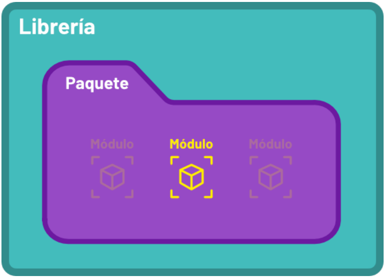
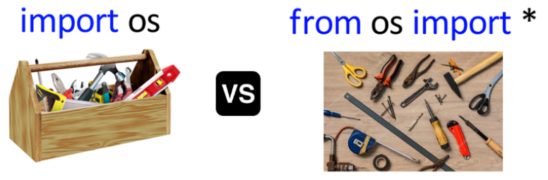
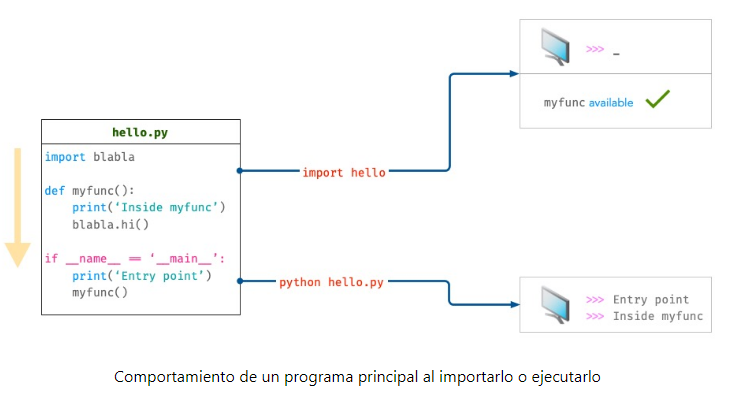

Los módulos son simplemente ficheros de texto que contienen código Python y representan unidades con las que evitar la repetición y favorecer la reutilización

Los módulos pueden agruparse en carpetas denominadas 'paquetes' mientras que estas carpetas, a su vez, pueden dar lugar a 'librerias'

¿CÓMO IMPORTAR MÓDULOS?

 -> Concepto de módulo, paquete y librería

- IMPORTAR UN MÓDULO COMPLETO -> import <module>

- IMPORTAR PARTES DE UN MÓDULO -> from <module> import <module>

- IMPORTAR VARIOS OBJETOS (FUNCIONES) DESDE UN MISMO MÓDULO -> from <module> import <module>, <module>

- IMPORTAR TODOS LOS COMPONENTES DEL MÓDULO -> from <module> import \*

 -> Diferencia entre importar un módulo o su contenido

- IMPORTAR USANDO UN ALIAS -> Usar un nombre diferente del módulo (u objeto) que estamos importando. Python ofrece la sentencia 'as' -> from <module> import <module> as <name>

PAQUETES -> Un paquete es una carpeta que contiene ficheros '.py'. Además permite tener una jerarquía con más de un nivel de subcarpetas anidadas.

- IMPORTAR DESDE UN PAQUTE -> from <package> import <module>, <module>

- PROGRAMA PRINCIPAL -> Módulo 'main2.py'

 -> Comportamiento de un programa principal al importarlo o ejecutarlo
